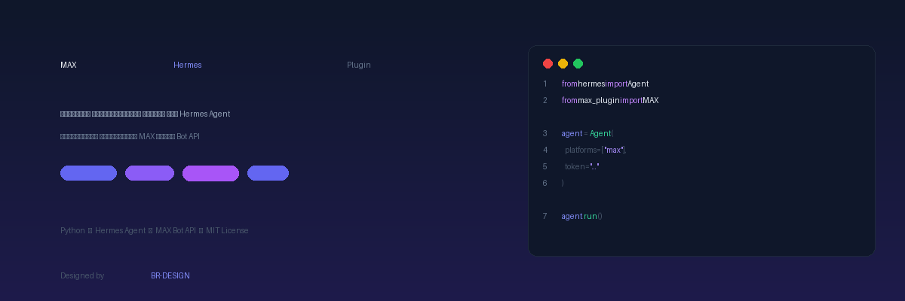

<div align="center">

  

  <h3>🛠️ Технологии</h3>

  <p>
    
    
    
    
    
    
    
  </p>

  <h3>Нативный платформенный плагин для <a href="https://hermes-agent.nousresearch.com">Hermes Agent</a></h3>
  <p>Подключает мессенджер <a href="https://max.ru">MAX</a> через Bot API — полная интеграция с AI-агентом</p>

  <p><sub>🎨 Designed by <a href="https://br-design.ru/">BR-DESIGN</a></sub></p>

</div>

---

## 📋 Содержание

- [Возможности](#-возможности)
- [Установка](#-установка)
- [Настройка](#-настройка)
- [Использование](#-использование)
- [Архитектура](#-архитектура)
- [Сравнение с Telegram Bot API](#-сравнение-с-telegram-bot-api)
- [Лицензия](#-лицензия)

---

## ✨ Возможности

| Фича | Статус |
|------|--------|
| Приём и отправка текстовых сообщений | ✅ |
| Inline keyboard (кнопки с callback) | ✅ |
| Индикатор «Печатает...» | ✅ |
| Markdown-форматирование | ✅ |
| Белый список пользователей | ✅ |
| Webhook + Long Polling | ✅ |
| Отправка изображений (через upload API) | ✅ |

## 📦 Установка

### Из исходников

```bash
# Клонируйте репозиторий в папку плагинов Hermes
git clone https://github.com/RuslanStrogov/max-hermes-plugin.git \
  ~/.hermes/plugins/platforms/max

# Перезапустите Hermes Gateway
hermes gateway restart
```

### Через hermes plugins (если опубликован)

```bash
hermes plugins install max-platform
```

## ⚙️ Настройка

### 1. Создайте бота в MAX

> ⚠️ **Важно:** Создание ботов на платформе MAX доступно **только юридическим лицам, ИП и самозанятым** (резидентам РФ). Физическим лицам создание ботов **недоступно**.

| Тип профиля | Кол-во ботов |
|---|---|
| Организация / ИП | Несколько (не ограничено платформой) |
| Самозанятый | Ограничено |

**Пошаговая инструкция:**

1. Перейдите на [портал MAX для партнёров](https://business.max.ru)
2. **Создайте и верифицируйте профиль** организации, ИП или самозанятого
3. В панели управления нажмите **«Добавить бота»**
4. Заполните данные бота (карточка):
   - **Название** — от 1 до 59 символов
   - **Никнейм** — генерируется автоматически (должен заканчиваться на `_bot`)
   - Сайт организации, логотип и описание
5. Нажмите **«Готово»** — бот создан и отправлен на **модерацию**
6. Дождитесь уведомления о прохождении модерации
7. После модерации **получите токен бота**

Подробнее: [MAX для разработчиков — Создание чат-бота](https://dev.max.ru/docs/chatbots/bots-create)

### 2. Настройте переменные окружения

```bash
# Добавьте в ~/.hermes/.env
MAX_BOT_TOKEN=your_bot_token_here
MAX_WEBHOOK_URL=https://your-domain.com/webhook
MAX_WEBHOOK_SECRET=your_secret
```

Или через `config.yaml`:

```yaml
gateway:
  platforms:
    max:
      enabled: true
      extra:
        token: "your_bot_token"
        webhook_url: "https://your-domain.com/webhook"
        allowed_users: []
```

### 3. Настройте сервер

Nginx reverse proxy:

```nginx
server {
    listen 443 ssl;
    server_name your-domain.com;

    location /webhook {
        proxy_pass http://127.0.0.1:8787;
        proxy_set_header Host $host;
        proxy_set_header X-Real-IP $remote_addr;
    }
}
```

### 4. Запустите

```bash
hermes gateway restart
```

## 🚀 Использование

После подключения бот будет автоматически:
- Принимать сообщения от пользователей MAX
- Передавать их агенту Hermes
- Отправлять ответы обратно в MAX

### Inline keyboard

Агент может отправлять сообщения с кнопками:

```python
buttons = [
    [{"text": "Да", "payload": "yes"}, {"text": "Нет", "payload": "no"}]
]
```

## 🏗️ Архитектура

```
┌──────────┐   webhook    ┌─────────────────┐   native    ┌──────────────┐
│          │ ──────────►  │                 │ ──────────►  │              │
│ MAX Bot  │              │ MAX Hermes      │              │ Hermes Agent │
│ API      │ ◄──────────  │ Plugin          │ ◄──────────  │              │
│          │  send_msg    │ (Python)        │  response    │              │
└──────────┘              └─────────────────┘              └──────────────┘
```

1. Пользователь пишет боту в MAX
2. MAX API отправляет webhook на плагин
3. Плагин передаёт сообщение в Hermes Agent
4. Ответ Hermes отправляется обратно в MAX через Bot API

## 📊 Сравнение с Telegram Bot API

| Возможность | Telegram | MAX Bot API |
|-------------|----------|-------------|
| Webhook | ✅ | ✅ |
| Long Polling | ✅ | ✅ |
| Inline keyboard | ✅ | ✅ |
| Reply keyboard | ✅ | ❌ (только inline) |
| Callback buttons | ✅ | ✅ |
| Send/Edit/Delete messages | ✅ | ✅ |
| Typing indicator | ✅ | ✅ |
| Read receipts | ✅ | ❌ |
| Bot commands menu | ✅ | ❌ |
| Send images/files | ✅ | ✅ (через upload) |
| Group chats | ✅ | ✅ |
| Channels | ✅ | ✅ |

## 📄 Лицензия

MIT License. См. [LICENSE](LICENSE).

---

## 🔗 Связанные проекты

| Проект | Описание |
|--------|----------|
| [MAX Hermes Bridge](https://github.com/RuslanStrogov/max-hermes) | Python-мост между MAX Bot API и Hermes Agent через CLI. Поддерживает webhook, Docker, systemd. |

## 📢 Пресс-релизы

Готовые тексты для публикации в сообществах и СМИ:

- [Короткий текст для Telegram-каналов](PRESS_RELEASE.md)
- [Подробный текст для Хабра/vc.ru/DTF](PRESS_RELEASE_DETAIL.md)
- [Пост для Reddit/Hacker News](PRESS_RELEASE_REDDIT.md)

<div align="center">

  <sub>🎨 Designed by <a href="https://br-design.ru/">BR-DESIGN</a></sub>

</div>


---
<div align="center">

  <sub>🇷🇺 Опенсорс — **Поддержи наш продукт** · <a href="https://br-design.ru/">BR-DESIGN</a></sub>

</div>
